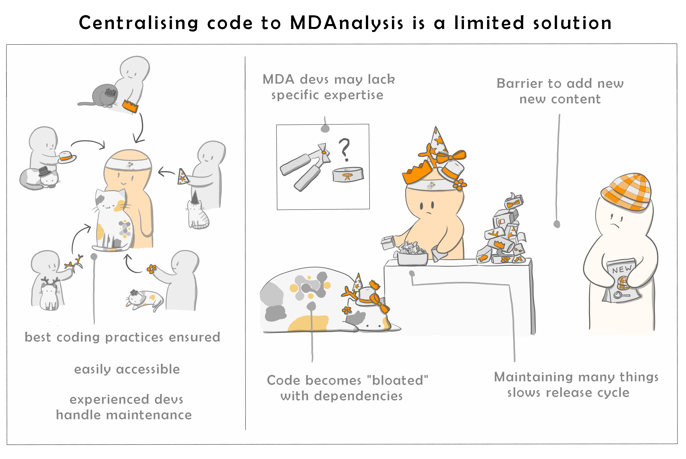
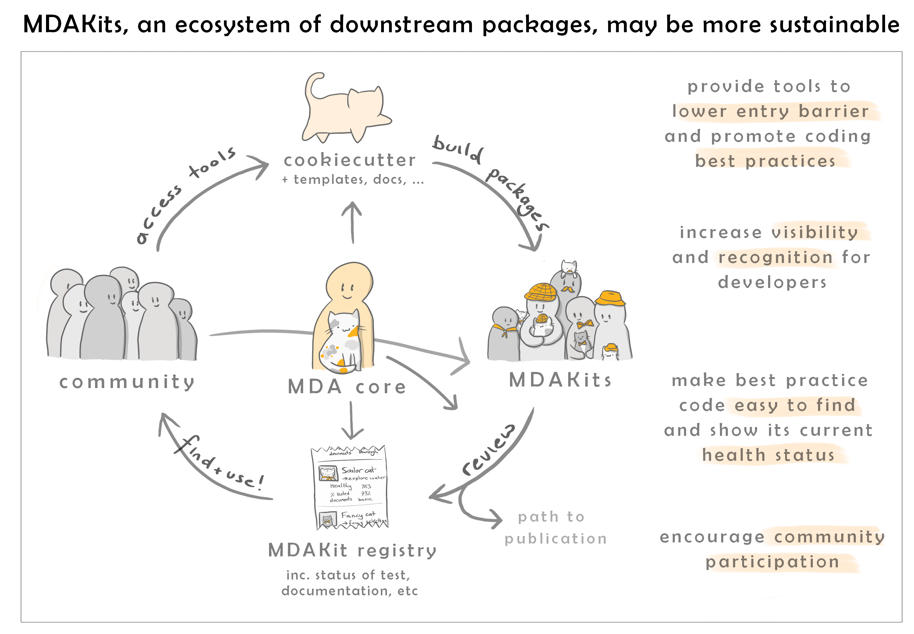

.. -*- coding: utf-8 -*-

*************
About MDAKits
*************

.. _what-is-an-MDAKit:

What is an MDAKit?
==================

MDAnalysis Toolkits (MDAKits) are standalone packages containing code using
components from the `MDAnalysis library`_ with the aim of solving specific
scientific problems or in some form enhance the functionality of the MDAnalysis
core library. An MDAKit can be written by anyone and hosted anywhere.

.. _requirements:

At the discretion of their authors, MDAKits can be **registered** in this
MDAKit registry. To do so, a MDAKit has to meet a **minimum set of
requirements**:

#. The code in the package uses the MDAnalysis library
#. The code is open source and published under an `OSI approved license <https://opensource.org/licenses/>`_
#. The code is versioned and provided in an accessible version-controlled repository (GitHub, GitLab, Bitbucket, etc.)
#. Code authors and maintainers are clearly designated
#. Minimal documentation is provided (what your code does, how to install it,
   and how to use it)
#. At least minimal regression tests and continuous integration are present

It is also highly encouraged that the MDAKit also satisfies:

#. The code is installable as a standard package
#. Information on bug reporting, user discussions, and community guidelines is made available

Registered MDAKits are then `listed here`_ with the intention of providing a centralised
place where the community can find out more about them. Where possible, the MDAKits are
also *continually tested* against the *latest* and *development* versions of MDAnalysis.
This ensures that users and developers have an up-to-date view of the code health of an
MDAKit.

The specifications are written out in detail in :ref:`the MDAKits
paper<mdakits-paper>`.

Why?
====

The open sharing of code that abides by the basic principles of `FAIR`_ (findability,
accessibility, interoperability, and reusability) is essential to robust, reproducible,
and transparent science. However, scientists typically are not supported in making the
subtantial effort require to make software FAIR-compliant.

.. image:: _static/images/MDAcats_FAIR.png
   :width: 600
   :alt: Scientific code often falls short of FAIR tenets

One potential option, and one that MDAnalysis has historically attempted, is to attempt
to add as many methods as possible in a single centralised library. However, this is
a non-ideal solution.

Our goal with MDAKits is to **lower the barrier for researchers to produce FAIR software**.

We wish to support developers in creating new pakages, guiding them through the process
of achieving best practices and FAIR compliance. At the same time, we hope to make MDAnalysis
useful to a broader community.

.. _mdakits-paper:	 

Read our SciPy proceedings paper!
=================================

To learn more about MDAKits and our vision for more sustainable community
developed molecular simulation tools, please see our `SciPy
proceedings paper`_:

   Irfan Alibay, Lily Wang, Fiona Naughton, Ian Kenney, Jonathan Barnoud,
   Richard J Gowers, and Oliver Beckstein. *MDAKits: A framework for
   FAIR-compliant molecular simulation analysis* . *In* Meghann Agarwal, Chris
   Calloway, and Dillon Niederhut, editors, Proceedings of the 22nd Python in
   Science Conference (SCIPY 2023), pages 76–84, Austin, TX, 2023. doi:
   `10.25080/gerudo-f2bc6f59-00a`_.

.. _`MDAnalysis library`:
   https://docs.mdanalysis.org

.. _`SciPy proceedings paper`:
   https://conference.scipy.org/proceedings/scipy2023/ian_kenney.html

.. _`listed here`:
   mdakits.html

.. _`FAIR`:
   https://doi.org/10.15497/RDA00068

.. _`10.25080/gerudo-f2bc6f59-00a`:
   https://doi.org/10.25080/gerudo-f2bc6f59-00a
