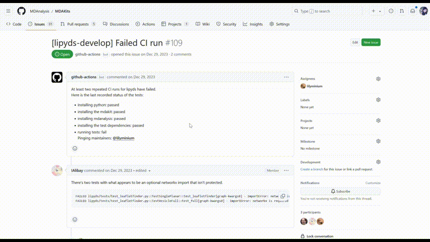

*************************
Keeping an MDAKit healthy
*************************

.. _failingci:

If an MDAKit fails the weekly CI
================================

In the event that a kit no longer passes its tests, an issue is automatically
raised on the `MDAKits Registry GitHub issue tracker`_, the maintainers (as identified in 
``metadata.yaml``) are notified, and the kit's CI badges appearing on the 
:ref:`Registry <mdakits>` will be updated.

Note that two tests are run:

- **develop**, using the 'current' version of your MDAKit (installed when
  running the commands under ``src_install`` in ``metadata.yaml``), and the
  current ``develop`` branch of MDAnalysis.

- **latest**, (if applicable) using the latest release of your MDAKit (installed
  when running the commands under ``install`` in ``metadata.yaml``), and the 
  most recent release of MDAnalysis.

Depending on the nature of the failure, one or both of **develop** and 
**latest** may be failing.

Why did CI fail?
----------------
There are a number of reasons that the CI tests may fail - it could be an
internal issue arising as you develop your kit, or it may indicate that updates
are needed to keep in line with changes within MDAnalysis or other dependencies.
It may reflect a single test that is no longer passing, or that a larger error
is preventing your kit from being installed/any tests from being run.

If you don't already have an idea what is causing your kit to fail, you can read
the CI log file to find the exact point of failure and accompanying error 
messages:

#. Click on the *'Actions'* tab on the 
   `MDAKits Github page <https://github.com/MDAnalysis/MDAKits/>`_.

#. Click on the most recent *'GH Actions Cron CI'* job.

#. Under *'Annotations'*, find and click the failing job(s) with your kit's 
   name. Failing jobs should show a red cross and be grouped at the top.

#. You should be directed to the place in the CI log where the failure occurs.
   Some scrolling may be required to find the origin of the error.

Fixing an failure
-----------------
Once the point of failure has been identified, you can set about trying to fix
it. The exact fix required will of course depend on exactly what went wrong, but
hopefully the error message(s) in the log will be enough to get you started.

Any fixes will be applied in your kit's home repository - no direct interaction
with the Registry is required. 

If you're still not sure what's gone wrong or how to fix it, you can comment on 
the issue that was raised on the `MDAKits GitHub`_. The MDAKits team, or
other members of the community, may be able to help - but remember, ultimate
responsibility remains with **you**. 

After applying a fix
--------------------
Once you have applied a fix to your MDAKit (and, if applicable, pushed a new 
release with these changes applied), no further action is required from you.

Assuming that the fix does indeed solve the issue, the tests will pass the next
time the automated CI is run. After the successful run, the CI badges on the
:ref:`Registry <mdakits>` will be restored to 'passing' and the issue raised on
the `MDAKits GitHub`_ will be automatically closed.

Keeping an eye out for upstream changes
=======================================
Avoid failing tests before they happen!

Just as you are likely to keep improving your kit, the upstream packages on
which it relies - including MDAnalysis - will also continue to evolve. 
Sometimes, this means that things your kit relies on will no longer work. 
Keeping an eye out for such changes will allow you to modify your kit 
appropriately *before* the upstream change is fully applied and your code 
starts to fail.

Usually, a package will warn users of any upcoming changes that may affect
downstream usage (e.g. changing how a function is to be used), by raising
a warning indicating the upcoming change when the function is used. 
If your kit relies on any such to-be-changed features, then (assuming the 
relevant code is covered by your kit's tests) these warnings will be triggered 
when running the tests and will appear in the logs of the automated CI runs - 
it pays to keep an eye on these!

It is also a good idea check release notes for new releases of packages your kit
uses and watch for any announcements of major upcoming changes.

Keeping support windows in mind
===============================
Your kit should specify which versions of the software it relies on (including
Python) it works with. Ideally, as new versions of these dependencies are 
released, your kit will be updated to work with these. 

It is *not* expected that your kit remains compatible with *all* historic 
releases - and indeed, many old versions of these packages will not work with
each other. These packages will also have **support windows** of how long after
a given release the developers will keep an eye to make sure it still works as 
intended.

`SPEC0 <https://scientific-python.org/specs/spec-0000/>`_ is a standard outlining 
a timeline of which versions of Python and common dependencies in the Scientific
Python ecosystem should be supported and compatible with each other. You can
follow SPEC0 to determine which Python/dependency versions you should aim to
support, and which old versions you can drop.

.. _`MDAKits GitHub`:
   https://github.com/MDAnalysis/MDAKits/issues
