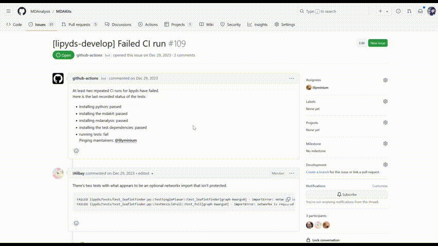

*************************
Keeping an MDAKit healthy
*************************

The MDAKit Registry CI
######################

.. _mdakitsci:

What is the 'MDAKit Registry CI'?
---------------------------------

The MDAKit Registry Continuous Integration is run twice a week and involves the 
(automatic) running of each kit's tests (as specified in the ``metadata.yaml`` 
file.

If the tests **pass**, the kit's 'CI badges', which appear on the 
:ref:`Registry <mdakits>` and are visibile to all potential users, remain green.

If the tests **fail**, an issue is automatically raised on the 
`MDAKits Registry GitHub issue tracker <https://github.com/MDAnalysis/MDAKits/issues>`_, 
the maintainers (as identified in 
``metadata.yaml``) are notified, and the CI badges updated to red to inform
others.

Note that there are two CI runs:

- **develop**, using the 'source' version (assumed to be the development 
  version) of your MDAKit (i.e., what is installed when running the commands 
  under ``src_install`` in ``metadata.yaml``), and the current ``develop`` 
  (under active development) branch of MDAnalysis.

- **latest**, (if applicable) using the latest release of your MDAKit (installed
  when running the commands under ``install`` in ``metadata.yaml``), and the 
  most recent release of MDAnalysis.

Depending on the nature of the failure, one or both of *develop* and 
*latest* may be failing. In many cases it will be only *develop* failing, as the 
effects of new changes to your kit (or to MDAnalysis) will be seen here as they
are made, but only in *latest* after the changes are published in a new release. 
Having *develop* gives you a chance to find and fix errors before they are 
carried through to a release, avoiding impacting (most) users.

.. _failingci:

Why did CI fail?
----------------
There are a number of reasons that the CI tests may fail - it could be an
internal issue arising as you develop your kit, or it may indicate that updates
are needed to keep in line with changes within MDAnalysis or other dependencies.
It may reflect a single test that is no longer passing, or that a larger error
is preventing your kit from being installed/any tests from being run.

You may already know the likely source of your kit's failure. If you have your own
CI, this could be a place to start.

Otherwise, you can read the CI log file for the MDAKit Registry CI run to find the 
exact point of failure and accompanying error messages:

#. Click on the `Actions tab <https://github.com/MDAnalysis/MDAKits/actions>`_ on 
   the MDAKits Github page.

#. Click on the most recent *'GH Actions Cron CI'* job.

#. Under *'Annotations'*, find and click the failing job(s) with your kit's 
   name. Failing jobs should show a red cross and be grouped at the top.

#. You should be directed to the place in the CI log where the failure occurs.
   Some scrolling may be required to find the origin of the error.

Fixing an failure
-----------------
Once the point of failure has been identified, you can set about trying to fix
it. The exact fix required will of course depend on exactly what went wrong, but
hopefully the error message(s) in the log will be enough to get you started. If
you believe the issue is due to a breaking behaviour change in MDAnalysis, we
encourage you to raise an issue on the 
`core library issue tracker <https://github.com/MDAnalysis/mdanalysis/issues>`_.

Any fixes will be applied in your kit's home repository - no direct interaction
with the Registry is required.

If you're still not sure what's gone wrong or how to fix it, you can comment on 
the issue that was raised on the `MDAKits GitHub`_. The MDAKits team, or
other members of the community, may be able to help - but remember, ultimate
responsibility remains with **you**. 

.. note::

   If your fix affects any your kit's metadata.yaml, e.g. if the installation
   instructions changed, rember to 
   :ref:`update your metadata <update-metadata>` as appropriate.

After applying a fix
--------------------
Once you have applied a fix to your MDAKit (and, if applicable, pushed a new 
release with these changes applied), no further action is required from you.

Assuming that the fix does indeed solve the issue, the tests will pass the next
time the automated CI is run. After the successful run, the CI badges on the
:ref:`Registry <mdakits>` will be restored to 'passing' and the issue raised on
the `MDAKits GitHub`_ will be automatically closed.

Keeping an eye out for upstream changes
=======================================
Avoid failing tests before they happen!

Just as you are likely to keep improving your kit, the upstream packages on
which it relies - including MDAnalysis - will also continue to evolve. 
Sometimes, this means that the parts of your kit that rely on these packages 
will no longer work. 
Keeping an eye out for such changes will allow you to modify your kit 
appropriately *before* the upstream change is fully applied and your code 
starts to fail.

Usually, a package will warn users of any upcoming changes that may affect
downstream usage (e.g. changing how a function is to be used), by raising
a `DeprecationWarning <https://docs.python.org/3/library/exceptions.html#DeprecationWarning>`_
indicating the upcoming change when used. 
If your kit relies on any such to-be-changed features, these warnings will
be triggered when accessing the deprecated feature, and (assuming the relevant
core is covered by your kit's tests) will appear in the output logs, so it's a
good idea to keep an eye on these.

Testing against *development* versions of packages, not just the latest release,
can also allow you to catch issues early. The :ref:`MDAKits Registry CI <mdakitsci>` 
tests both the latest release and development versions of your kit and MDAnalysis. 
If you've used the MDAKits cookiecutter, the generated GitHub workflow tests with
both the development and latest release of MDAnalysis.

It is also a good idea check release notes for new releases of packages your kit
uses and watch for any announcements of major upcoming changes.

Keeping support windows in mind
===============================
Your kit should specify which versions of the software it relies on (including
Python) it works with. Ideally, as new versions of these dependencies are 
released, your kit will be updated to work with these. 

It is *not* expected that your kit remains compatible with *all* historic 
releases - and indeed, many old versions of these packages will not work with
each other. These packages will also have **support windows** of how long after
a given release the developers will keep an eye to make sure it still works as 
intended.

`SPEC0 <https://scientific-python.org/specs/spec-0000/>`_ is a standard outlining 
a timeline of which versions of Python and common dependencies in the Scientific
Python ecosystem should minimally aim to be supported and compatible with each other. You can
follow SPEC0 to determine which Python/dependency versions you should aim to
support, and which old versions you can drop.

.. _`MDAKits GitHub`:
   https://github.com/MDAnalysis/MDAKits/issues
