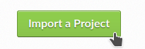
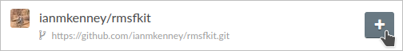

*******************************
Part 5: Providing documentation
*******************************

*For a video demonstration of this section,* 
`click here  <https://www.youtube.com/watch?v=viCPUHkgSxg&t=153s>`_.

The auto-generated ``README.md`` file contains a description of our
Kit and installation instructions. To meet the "minimal documentaiton"
requirement, we could just add basic usage to this file, giving a
simple *"README"-style* documentation. However, it is ideal to provide 
more thorough documentation.

Additional documentation can consist of **API documentation** or 
**User Guide** documentation. The former provides details of the
functions, inputs/outputs, datatypes, etc of the code and can 
be autogenerated from docstrings; while the later shows usage 
and provides more details, explanation and even examples for users.

`Read the Docs <read the docs_>`_ can be used to build and host 
documentation online. The cookiecutter includes a 
ReadtheDocs configuration as well a pre-made documentation 
environment file that is used by Read the Docs and for building 
locally. Frameworks for autogenerated API and basic User Guide 
documentation are also provided.


Building documentation locally
------------------------------

First, we can build a copy of the documentation to see what the 
cookiecutter template has started us with. 

#. We install the correct environment for building the documentation 
   by running the following in the ``docs/`` directory:

   .. code-block:: bash

	mamba env update --name rmsfkit -f requirements.yaml

#. We can now build the documentation HTML files using the included 
   ``Makefile``.

   .. code-block:: bash

	make html

   This will convert the reStructuredText files into HTML in the 
   ``_build`` directory.

We can now view the documentation by opening ``_build/index.html``!
If we make changes to any documentation files, we can reruin 
``make html`` and refresh the browser to view the changes.


Adding to the documentation
---------------------------

#. **Expanding the API documentation**: the autogenerated "API 
   Documentation" does not contain all of the information found in the 
   docstrings of our code. This is because the 'automummary' in 
   ``source/api.rst`` specified ``rmsfkit``, rather than specifically
   our analysis class, ``rmsfkit.RMSF``. We update it, so ``api.rst``
   now reads:

   .. code-block:: rst

	API Documentation
	=================
	
	.. autosummary::
	   :toctree: autosummary
	
	   rmsfkit.RMSF

   After making the change, we rerun ``make html`` and refresh the 
   page - there will now be a table entry for the RMSF class! Clicking 
   this entry will open the documentation that was present in the 
   docstrings


#. The rest of our documentation is currently empty. Let's update ``index.rst``, 
   which serves as our "home" page. We add a short description of the package:
   
   .. code-block:: rst

	Welcome to rmsfkit's documentation!
	=========================================================
	
	``rmsfkit`` is an example MDAKit that implements the functionality of the `analysis.rms.RMSF` class within the MDAnalysis package.
	This MDAKit does not serve as a replacement for this functionality and using this MDAKit for real work is discouraged.
	
	.. toctree::
	   :maxdepth: 2
	   :caption: Contents:
	
	   getting_started
	   api
	
	
	Indices and tables
	==================
	
	* :ref:`genindex`
	* :ref:`modindex`
	* :ref:`search`

#. Finally, we add some installation instructions to the 
   ``getting_started.rst`` pare to let potential users know how to 
   install the package.

.. code-block:: rst

	Getting Started
	===============
	
	The ``rmsfkit`` package is installable from source.
	
	.. code-block:: bash
	
	    git clone git@github.com:ianmkenney/rmsfkit.git
	    cd rmsfkit/
	    pip install .

Run the ``make html`` command again and refresh the browser window will 
let us view the resulting changes. 

Ideally, we could also add more information explaining the usage of 
``rmsfkit``; however, the API documentation generated from the docstrings
is already reasonably thorough, so we'll leave our documentation here
for now.


**Citations in documentation**

You'll notice the RMSF class documentation has an unformatted citation 
(``:cite:p:`Welford1962```). We can easily include citations using the 
bibtex format.

#. We first create the bibtex file, ``references.bib`` in the ``doc/source/`` 
   directory:

   .. code-block:: bib

	@article{Welford1962,
	    author = { B. P.   Welford},
	    title = {Note on a Method for Calculating Corrected Sums of Squares and Products},
	    journal = {Technometrics},
	    volume = {4},
	    number = {3},
	    pages = {419-420},
	    year  = {1962},
	    publisher = {Taylor & Francis},
	    doi = {10.1080/00401706.1962.10490022}
	}

#. In ``conf.py``, we need to add a new extension 
   (``sphinxcontrib.bibtex``) as well as the name of the bibtex file.

   .. code-block:: Python

	extensions = [
	    'sphinx.ext.autosummary',
	    'sphinx.ext.autodoc',
	    'sphinx.ext.mathjax',
	    'sphinx.ext.viewcode',
	    'sphinx.ext.napoleon',
	    'sphinx.ext.intersphinx',
	    'sphinx.ext.extlinks',
	    'sphinxcontrib.bibtex',  # add this line
	]
	
	bibtex_bibfiles = ['references.bib']

#. We also have to add this extension the install requirements in 
   ``docs/requirements.yaml``. Add ``- sphinxcontrib-bibtex`` as an 
   additional dependency here.

#. We update the environment with

.. code-block:: bash

	mamba env update --name rmsfkit -f requirements.yaml

   before once again running `make html`.

Refreshing the RMSF documentation will now show a properly formatted citation 
using the information in the bibtex file.


Deploying the documentation
---------------------------

After pushing documentation changes to GitHub, we can then display them 
on their own shiny new website.

Log into `Read the Docs <read the docs_>`_ (using your GitHub account) and 
navigate to the dashboard. Click the "Import a Project" button and find the 
repository in the list. Click the "+" and confirm that the name, URL, and default branch are
correct.





Clicking next will begin the deployment. This immediately starts the build
process, which can be confirmed by clicking the "Builds" tab. Once the build is
completed, you can view the deployed documentation, which is now public. This
completes the documentation requirement for an MDAKit. Notice that the "docs"
badge in the GitHub rendered ``README.md`` is now green.


Progress: MDAKit requirements
-----------------------------

#. **✓ Uses MDAnalysis**
#. **✓ Open source + OSI license**
#. **✓ Versioned + on a version-controlled repository**
#. **✓ Designated authors and maintainers**
#. **✓ (At least) minimal documentation**
#. **✓ (At least) minimal regression tests**
#. **✓ Installable as a standard package**
#. **✓ (Recommended) community information available**
#. *(Recommended) on a package distribution platform*


.. _read the docs: https://readthedocs.org
