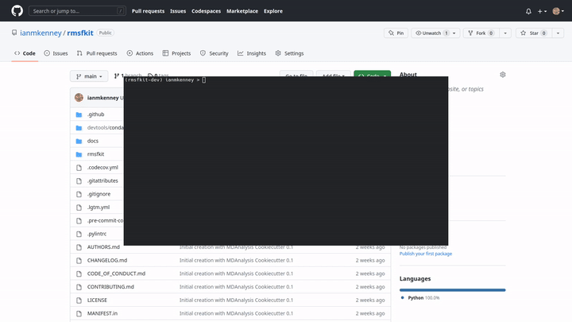

*********************************
Part 6: Making an initial release
*********************************

*For a video demonstration of this section,* 
`click here  <https://www.youtube.com/watch?v=viCPUHkgSxg&t=247s>`_.

While using git does satisfy the requirement that our MDAKit code be versioned,
it is a good idea to make numbered releases with (human-understandable) version
numbers to easily track your code as changes and improvements are made.

The MDAKit cookiecutter uses the 
`versioneer utility <https://github.com/python-versioneer/python-versioneer>`_ 
for version management. In brief, software versions are set through 
`git tags <https://git-scm.com/book/en/v2/Git-Basics-Tagging>`_.

#. Since the Kit is initiated without tags, the current version is set to 
   ``0.0.0``. 

   .. code-block:: bash

	>>> import rmsfkit  
	>>> rmsfkit.__version__  
	'0+untagged.3.g3eed836'

   Bump this to a ``0.1.0`` in preparation for an initial release on GitHub 
   using a `git tag`:

   .. code-block:: bash

	$ git tag 0.1.0

   This should now be reflected in the interpreter (though may require a package
   reinstall):

   .. code-block:: bash

	>>> import rmsfkit  
	>>> rmsfkit.__version__  
	'0.1.0'

#. Tags are not pushed to remote repositories by default. To push the ``0.1.0``
   tag, use:

   .. code-block:: bash

	$ git push --tags

#. Viewing the repository tags page on GitHub, you should now see a ``0.1.0`` 
   tag. Expanding its menu gives us the option to create a release based on the 
   tagged code. Enter a release name, such as `v0.1.0` and publish!

Going forward, you could publish this release to a package distribution 
platforms such as PyPi or Conda-Forge, though this is not covered in this 
example.

Having met all the requirements, it's now time to register our MDAKit!

Progress: MDAKit requirements
-----------------------------

#. **✓ Uses MDAnalysis**
#. **✓ Open source + OSI license**
#. **✓ Versioned + on a version-controlled repository**
#. **✓ Designated authors and maintainers**
#. **✓ (At least) minimal documentation**
#. **✓ (At least) minimal regression tests**
#. **✓ Installable as a standard package**
#. **✓ (Recommended) community information available**
#. *(Recommended) on a package distribution platform*

